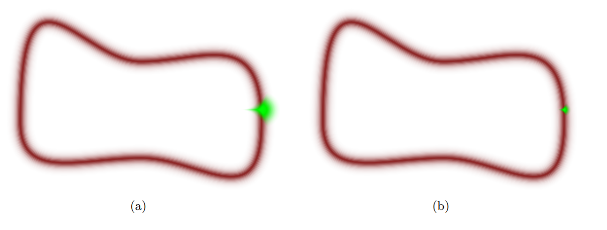
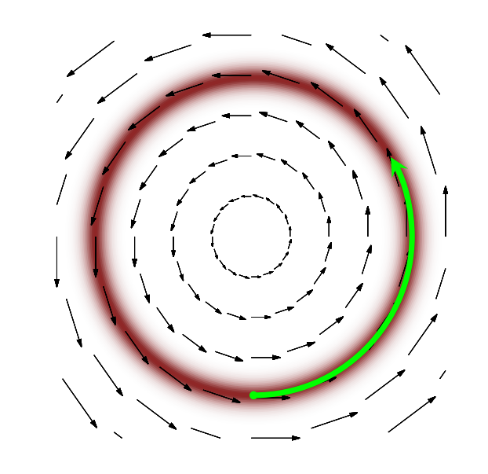
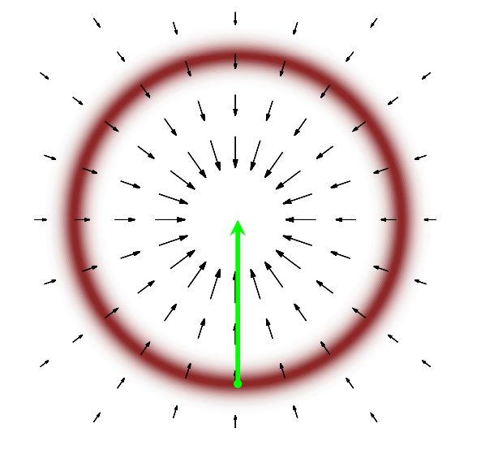
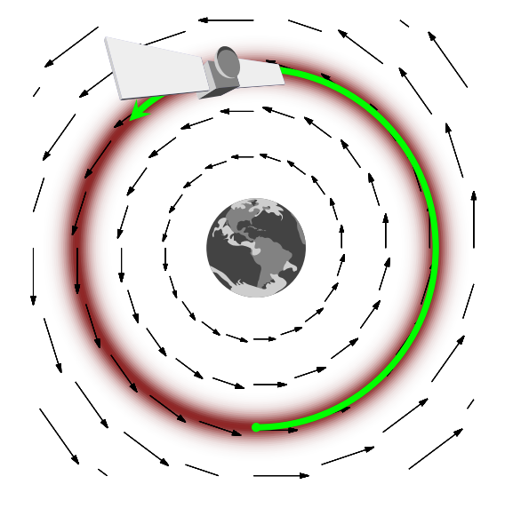

class: title-slide

# Review
$$
  \require{cancel}
  \DeclareMathOperator*{\argmin}{arg\,min}
$$
  
```{r, echo = F, message=F, warnings=F}
library(tidyverse)
library(haven)
library(estimatr)
library(knitr)

options(digits=3)

```

---

# Previously

$$
  \DeclareMathOperator*{\argmax}{arg\,max}
$$

- **Bayesian inference**
  - Parameters of interest are **random** variables (randomness captures "beliefs")
  - Contrast with **frequentist** approach: parameter is fixed, data is random
  - **Bayesian** target of inference is the **posterior** distribution $p(\theta | \mathbf{Y})$
  - **Bernstein-von Mises theorem** - in large samples, bayesian posterior distributions approximate MLE sampling distributions.
--

- **Posterior inference**
  - Some posteriors have an analytically tractable form -- typically we get this through the use of **conjugate priors**
  - Most posterior distributions are not analytically tractable -- need to do inference **numerically** via sampling
  - **Markov Chain-Monte Carlo** - Construct a chain of samples that converge to a stationary distribution which happens to be the target posterior.
  - **Metropolis-Hastings** - An algorithm to generate a chain that approximates a target posterior
  - **Gibbs Sampling** - Special case of MH where samples are from alternating **conditional distributions**

---

# This week

- **MCMC via Stan**
  - Stan is a C++ library for specifying statistical models and conducting inference via **Hamiltonian MCMC**
  - R has *bindings* to Stan via the `rstan` package
  - Extremely flexible - any model that you can write can be translated to machine code an estimated using an algorithm that converges much more quickly than conventional MH
--

- **Model diagnostics**
  - How do we know if our model is good?
  - Posterior predictive checks
  - Cross-validation, Leave-one-out CV
--

- **Multilevel models**
  - What happens when we impose further structure on parameters (e.g. random slopes and intercepts)
  - Choices of **hyperpriors** governs the extent of **partial pooling** 

---

---
class: title-slide

# Gibbs Sampling Continued

---

# Aside: Conditional distributions

- When we discussed **Gibbs Sampling** we illustrated the significant gains we can obtain over naive Metropolis-Hastings
  - Faster convergence, less correlation between samples
--

- These gains come from **theory** - being able to derive the form of the conditional distribution of $\theta_k$ given the other parameters $\theta_{-k}$ as well as the data $\mathbf{Y}$.
--

- Deriving these conditionals often relies on inspecting a density that is proportional to the conditional density and recognizing its form.
  - To do this, it's useful to remember the connection between **conditional** densities and **joint** densities as well as how **joint** densities factor.

---

# Aside: Conditional distributions

-  Consider our **normal regression** example, we want to obtain samples from the joint density $f(\beta, \sigma^2 | \mathbf{Y})$
  - To do so, we need the conditionals $f(\beta | \mathbf{Y}, \sigma^2)$ and $f(\sigma^2 | \mathbf{Y}, \beta)$.
  - Can we derive them (or at least their distributional forms?)
--

- Remember the definition of a conditional expectation: joint divided by marginal

$$f(\beta | \mathbf{Y}, \sigma^2) = \frac{f(\beta, \sigma^2 | \mathbf{Y})}{f(\sigma^2 | \mathbf{Y})}$$
--

- Since we treat $\sigma^2$ here as a constant, we can write

$$f(\beta | \mathbf{Y}, \sigma^2) \propto f(\beta, \sigma^2 | \mathbf{Y}) \equiv f(\mathbf{Y} | \beta, \sigma^2)f(\beta, \sigma^2)$$

- where the last part follows from the definition of the posterior

---

# Aside: Conditional distributions

- Next, remember how distributions factor

$$f(\beta, \sigma^2) = f(\beta | \sigma^2)f(\sigma^2)$$

--

- If $\beta$ and $\sigma^2$ are marginally independent,then the joint distribution factors into the **marginals**
  - But even if they're not independent, we can always factor into a product of conditionals
--

- So we have 

$$f(\beta | \mathbf{Y}, \sigma^2) \propto f(\mathbf{Y} | \beta, \sigma^2)f(\beta | \sigma^2) f(\sigma^2)$$

--

- Again, $\sigma^2$ is a constant here, so that last density drops as a multiplicative constant

$$f(\beta | \mathbf{Y}, \sigma^2) \propto f(\mathbf{Y} | \beta, \sigma^2)f(\beta | \sigma^2)$$
---

# Aside: Conditional distributions

- Remember, our special case of the normal model from last week assumed that $\beta$ and $\sigma^2$ are marginally independent

$$f(\beta | \mathbf{Y}, \sigma^2) \propto f(\mathbf{Y} | \beta, \sigma^2)f(\beta)$$

--

- And independence of observations gives 

$$f(\beta | \mathbf{Y}, \sigma^2) \propto \bigg[\prod_{i=1}^N f(Y_i | \beta, \sigma^2)\bigg]f(\beta)$$
- The key is finding densities that are given by our model description - now all of these factors are known

$$f(\beta | \mathbf{Y}, \sigma^2) \propto \bigg[\prod_{i=1}^N \underbrace{f(Y_i | \beta, \sigma^2)}_{\text{Normal}(X_i^{\prime}\beta, \sigma^2)}\bigg]\times\underbrace{f(\beta)}_{\text{Normal}(b_0, B_0^{-1})}$$

--

- One useful property from probability theory is that products of two normal PDFs are proportional to the normal PDF
  - So $\beta | \mathbf{Y}, \sigma^2$ is normal!
  
---

# Aside: Conditional distributions

- From normal regression theory, we can derive the mean and variance of that posterior distribution
- **Variance-Covariance matrix**

$$V = \sigma^2(B_0 + \mathbf{X}^{\prime}\mathbf{X})^{-1}$$
--

- And **Mean**

$$\mu = (B_0 + \mathbf{X}^{\prime}\mathbf{X})^{-1}(B_0b_0 + \mathbf{X}^{\prime}\mathbf{Y})$$

--

- Note again how the posterior distribution combines the data and the prior with the influence of the prior diminishing as the number of observations grows.
--

- $\sigma^2$ also has a conditional that is inverse-gamma with a similar intuition for the updates, but we'll skip that and keep our random walk sampler for $\sigma^2$ to illustrate the "Metropolis-in-Gibbs" approach.

---


# Revisiting: Predicting Elections

```{r, message=F, warning=F}
# Load the data
elections <- read_csv("data/us-house-wide.csv")

# Aggregate the house data to counties
elections_county <- elections %>% group_by(fipscode) %>% summarize(state=state[1], county=county[1], 
                                                                   total.votes = sum(total.votes),
                                                                   dem = sum(dem))

# Merge in 2015 Presidential
pres_2016 <- read_csv("data/clinton_2016_vote.csv")
elections_county <- elections_county %>% left_join(pres_2016 %>% dplyr::select(county_fips, candidatevotes, totalvotes),
                                                   by=c(fipscode="county_fips"))

# Generate vote shares
elections_county$dem2018 <- elections_county$dem/elections_county$total.votes
elections_county$dem2016 <- elections_county$candidatevotes/elections_county$totalvotes

# Drop missing
elections_county <- elections_county %>% filter(!is.na(dem2018)&!is.na(dem2016))
```

---

# Gibbs and Metropolis

- Set up the regression

```{r, message=F, warning=F}
X_mat <- model.matrix(dem2018 ~ dem2016, data=elections_county)
Y <- elections_county$dem2018
K <- ncol(X_mat) # Number of beta parameters
```

- Set up a diffuse prior

```{r}
beta_0 <- rep(0, K)
B_0 <- diag(rep(1/9, K))
B_inv_0 <- solve(B_0)
c_0 = 0.001
d_0 = 0.001
```

- Set up the MCMC

```{r, cache=T}
M <- 40000  # Number of MCMC samples
burnin <- 5000
beta_mcmc <- matrix(nrow = M, ncol=K) # Vector to store our samples
beta_mcmc[1,] <- c(0,1) # Pick a starting value
sigma_mcmc <- rep(NA, M)
sigma_mcmc[1] <- 1
```

---

# Gibbs and Metropolis

- Write some functions to evaluate the likelihood and priors

```{r}
log_lik_norm <- function(b, sigma, Y, X){
  linpred <- X%*%b
  sum(dnorm(Y, mean=linpred, sd=sigma, log=T))
}
```

---

# Gibbs and Metropolis

```{r, cache=T}
set.seed(60637)
for (i in 1:(M-1)){ # For i in 1:(M-1)
  ## Beta 
    ## Gibbs Step!
    var_b <- solve(t(X_mat)%*%X_mat + B_0)
    mean_b <- var_b%*%(B_0%*%beta_0 + t(X_mat)%*%Y)
    beta_mcmc[i+1,] <-  mvtnorm::rmvnorm(1, mean  = mean_b, sigma=(sigma_mcmc[i]^2)*var_b)

  ## Sigma
    ## Step 1 - Proposal
    sigma_log <- rnorm(1, mean = log(sigma_mcmc[i]), sd=.01)
    sigma_star <- exp(sigma_log)
  
    ## Step 2 - Accept/Reject
    lik_star_sigma <- log_lik_norm(beta_mcmc[i+1,], sigma_star, Y, X_mat)
    lik_current_sigma <- log_lik_norm(beta_mcmc[i+1,], sigma_mcmc[i], Y, X_mat)
    # The trick here is independence - otherwise if \sigma^2 appeared in the prior for \beta, we'd need another term
    prior_star_sigma <- log(MCMCpack::dinvgamma(sigma_star^2, shape = c_0/2, scale = d_0/2))
    prior_current_sigma  <-  log(MCMCpack::dinvgamma(sigma_mcmc[i]^2, shape = c_0/2, scale = d_0/2))
    
    ## Accept/reject
    ar_sigma <- exp(lik_star_sigma + prior_star_sigma - lik_current_sigma - prior_current_sigma)
    accept_sigma <- rbinom(1,1,min(1,ar_sigma))
    sigma_mcmc[i+1] <- sigma_star*accept_sigma + sigma_mcmc[i]*(1-accept_sigma)
    
}
beta_mcmc_use <- beta_mcmc[burnin:M,] # Toss our burn-in period
```

---

# Convergence

- $\beta_1$

```{r, fig.align="center", fig.height=4, fig.width=7}
plot(y=beta_mcmc_use[,2], x=1:length(beta_mcmc_use[,2]), xlab="Iteration", ylab="beta_1", type="l")
```

- Much better than before with the naive "random walk" proposal distribution.

---

# Results

$\beta_1$

```{r, fig.align="center", fig.height=4, fig.width=7, warning=F}
beta_mcmc_out <- as.data.frame(beta_mcmc_use)
colnames(beta_mcmc_out) <- c("Intercept", "dem2016")
beta_mcmc_out %>% ggplot(aes(x=dem2016)) +  theme_bw() + xlim(1.02, 1.10) + xlab("2016 Democratic Presidential Vote") + geom_histogram(aes(y=after_stat(density)), bins=50)
```

---

# Summaries

- Posterior means and 95% credible intervals

```{r}
summary_results <- data.frame(variable = c("Intercept", "dem2016"), pm = colMeans(beta_mcmc_out), 
                              ci95_lower = apply(beta_mcmc_out, 2, function(x) quantile(x, .025)),
                              ci95_upper = apply(beta_mcmc_out, 2, function(x) quantile(x, .975)))

summary_results
```

---

class: title-slide

# Intro to Stan/HMC

---

# Overview of HMC

- **Hamiltonian Monte Carlo** is a method that improves upon the conventional Metropolis-Hastings algorithm by improving the **proposals** such that they are accepted with very high probability
  - The specific method implemented in Stan is the "No U-Turn Sampler" (Hoffman and Gelman, 2011)
--

- The method draws on a theoretical core from differential geometry, but it's not strictly necessary to get the intuition for it. 
  - [Betancourt (2014) "A Conceptual Introduction to Hamiltonian Monte Carlo"](https://arxiv.org/abs/1701.02434) is a good overview for applied researchers (familiarity with statistics but not physics)
--

- MCMC (ideally) works by 3 general phases 
  1. From the starting values, reach the "typical set" of parameter values that occupy most of the posterior density mass
  2. The MCMC traverses the "typical set" of values once.
  3. Repeated traversals improve the quality of the MCMC approximation.
--

- Problems arise when Markov Chains 
  1. Don't traverse high density parts of the posterior
  2. Get *stuck* in parts of the density.
--

- How do we get proposals that are likely to get accepted?

---

# Overview of HMC

- Typical distributions for $Q$ are random walks
  - In high dimensions, these tend to be **bad** proposals.
--

- One solution is to choose a low variance for the random walk
  - This leads to high autocorrelation in the proposals

--

.center[]

---

# Overview of HMC

- What if we could come up with a "direction" to point our proposal (or sequence of proposals) that stayed in the "typical set"

.center[]

---

# Overview of HMC

- The gradient of the posterior gets us close, but we need to augment it to get the desired field.

.center[]

---

# Overview of HMC

- Analogizing to a physical system, HMC introduces a "momentum" variable $p$ for each parameter $q$
  - $H(p, q)$ is the "Hamiltonian" for each point -- a sum of "kinetic" and a "potential" energies -- the potential energy is the log density.
  - Using Hamilton's equations of motion, we obtain a method for generating updates that "conserve" energy
  
.center[]

---

# Overview of HMC

- **Central intuitions**
  - Hamiltonian Monte Carlo is designed to generate proposals with **high acceptance probability**
  - These proposals require knowing the **gradient** of the unnormalized posterior with respect to the parameters
--

- Analytical computation of the gradient is tedious
  - Numeric computation can be unstable.
  - Many modern techniques use **automatic** differentiation
--

- **Intuition**: Decompose the unnormalized posterior into a series of elementary arithmetic operationns and functions where derivatives are trivially known
  - Use the **chain rule** to construct the gradient from the component functions + their derivatives.

---

# Overview of Stan

- `Stan` is a C++ library that implements a version of Hamiltonian Monte Carlo
  - Latest iteration of the "model-to-MCMC" libraries like `JAGS` and `BUGS` (which are gibbs samplers)
--

- Key Features
  1. Language agnostic - has bindings in R, Python, Julia, STATA, etc...
  2. Fast run-time
  3. High-level language for specifying models to be converted to C++ code.
--

- Complications
  - Running Stan requires you to have the ability to compile C++ code locally
  - Stan also requires learning a slightly new syntax 
  
---

# Stan resources

- [Installation Quick Start Guide](https://github.com/stan-dev/rstan/wiki/RStan-Getting-Started)
- [Stan User Guide](https://mc-stan.org/docs/stan-users-guide/index.html)
- [Stan Reference Manual](https://mc-stan.org/docs/stan-users-guide/index.html)
- [Stan Functions Reference](https://mc-stan.org/docs/functions-reference/index.html)
- [A good model building tutorial for social scientists by Jim Savage](https://rpubs.com/jimsavage/stanintro)

---

# Installing Rstan

- We're working with R, so we'll be using the `Rstan` interface to Stan
- **To Install**
  - Install the *latest development version* (2.34) directly from [mc-stan.org](https://mc-stan.org/) 
  - Currently, the version on CRAN uses slightly dated syntax

```{r, eval=F}
# run the next line if you already have rstan installed
# remove.packages(c("StanHeaders", "rstan"))
install.packages("StanHeaders", repos = c("https://mc-stan.org/r-packages/", getOption("repos")))
install.packages("rstan", repos = c("https://mc-stan.org/r-packages/", getOption("repos")))
```

---

# Installing Rstan

- In order to run Stan, your computer needs to be able to compile C++ code. This requires some auxiliary installs that are dependent on your operating system
  - **Windows**: On Windows, you need to install `Rtools`. See instructions: [https://github.com/stan-dev/rstan/wiki/Configuring-C---Toolchain-for-Windows](https://github.com/stan-dev/rstan/wiki/Configuring-C---Toolchain-for-Windows)
  - **Mac**: Mac has a nice installer package for its C++ toolchain [https://github.com/rmacoslib/r-macos-rtools#how-do-i-use-the-installer](https://github.com/rmacoslib/r-macos-rtools#how-do-i-use-the-installer)
  - **Linux**: You probably already have it, but you need `g++` or `clang++` - either tends to be installed by default or is available from your repositories.
  
---

# Writing a Stan program

- Stan programs define a particular statistical model through a sequence of blocks that identify the data (modeled and unmodeled), parameters, and statistical model.
  - These are then translated to C++ and compiled. Because Stan uses C++, variables need to be declared differently from a language like R.
  - C++ is **statically typed** - which means that the *type* of variable needs to be fixed at initialization.
--

-  Primary variable types and their syntax
  - `int`: Integer and `real`: continuous values
  - `vector` and `matrix` for real-valued column vectors and matrices
  - `array` allows you to generate an array structure for any arbitrary type (like an integer) (note pre-2.26 Stan used a different syntax for this)

--
- If variables are constrained, these constraints can be added via `<upper = .>` and `<lower = .>` statements during variable declaration.
--

- **Minor notes**
  - Stan programs in R can be saved as separate files (with a `.stan` suffix) or in a length 1 character vector (directly typed into R).
  - Lines end with semi-colons `;`
  - `//` denotes a comment
  
---

# Program blocks

- `data`: Defines the modeled (e.g. $Y$) and unmodeled data (e.g. $X$) that are used in the model.
  - Includes any important constants (like sample size $N$) or number of parameters $K$ that you don't hard-code.
  - When compiling and estimating the model, you'll pass in R objects for each entry defined in `data` through a list
--

- Example data block (for a logistic regression):

```{stan output.var='data', eval=F, tidy=F}
data{
  int N; // number of observations
  int K; // number of covariates
  matrix[N, K] X; //matrix of covariates
  array[N] int<lower=0, upper=1> y; // binary outcome
}
```
  

---

# Program blocks

- `parameters`: Defines the parameters of interest whose posterior density we're trying to sample from
--

- Example parameters block (for a logistic regression):

```{stan, output.var='par', eval=F, tidy=F}
parameters{
  vector[K] beta; // beta coefficients
}
```
  

---

# Program blocks

- `model`: Defines the statistical distributions of the observed data + the parameters
  - Likelihood and prior distributions
--

- Example model block (for a logistic regression):

```{stan, output.var='model', eval=F, tidy=F}
model{
  beta ~ normal(0, 10); // normal prior
  y ~ bernoulli_logit(X * beta); //bernoulli outcome (logit link)
}
```

---

# Program blocks

- We can use for loops as well (can be useful for more complicated DGPs)

```{stan, output.var='modelfor', eval=F, tidy=F}
model{
  for (k in 1:K){
    beta[k] ~ normal(0, 10);
  }
  for (n in 1:N){
    y[n] ~ bernoulli_logit(X[n] * beta);
  }
}
```
  


---

# Program blocks

- Other useful (but not required) blocks
  - `functions`: Contains user-defined functions that can be used within the remainder of the model definition (or made available to R)
  - `transformed data`, `transformed parameters`: Contains deterministic transformations of either the data or the parameters.
  - `generated quantities`: Contains functions that generate or simulate quantities from the model after estimation (e.g. predictions, posterior means, model summary statistics)

---


# Application: Elections

- Let's implement the "Normal Regression" model in Stan
  
```{r}
model_structure <- "
data {
  int N; // number of observations
  int K; // number of covariates
  matrix[N, K] X; //covariate matrix
  vector[N] y; //outcome vector
}
parameters {
  vector[K] beta; //regression coefficients
  real<lower = 0> sigma; // standard deviation
}
model {
  beta ~ normal(0, 3); // multivariate normal prior
  sigma ~ inv_gamma(0.001/2, 0.001/2); // inverse gamma
  y ~ normal(X * beta, sigma); // * is matrix multiplication if terms are matrices
}
generated quantities {
  array[N] real y_rep = normal_rng(X * beta, sigma);
  vector[N] log_lik;
  for (n in 1:N) log_lik[n] = normal_lpdf(y[n] | X[n, ] * beta, sigma);
}
"
```

---

# Application: Elections

- Load the relevant packages

```{r, warning=F, message=F, results=F}
library(rstan)
```

- Pass the actual parameters as a list

```{r}
data_source <- list(N = nrow(X_mat), K = ncol(X_mat), X=X_mat, y=Y)
```

---

# Application: Elections

- Run Stan! 

```{r, echo=T, message=F, warning=F, cache=T, results=F}
model_fit <- stan(
  model_code = model_structure,  # Stan code
  data = data_source,    # named list of data
  chains = 4,             # number of Markov chains
  warmup = 500,          # number of warmup iterations per chain
  iter = 2500,            # total number of iterations per chain
  cores = 4,              # number of cores (could use one per chain - by default uses however many you have)
  refresh = 0,          # no progress shown
  seed = 60637
  )
```

---

# Convergence

- The `traceplot` function lets us plot trace plots of any parameters or generated quantities. Let's do it for $\beta$

```{r, fig.align="center", fig.width=10, fig.height=6}
traceplot(model_fit, pars = c("beta"))
```

---

# Summary

- Summarize the fit

```{r}
print(model_fit, pars = c("beta","sigma"))
```

---

# Summary

- Plot the results

```{r, message=F, fig.align="center", fig.width=7, fig.height=5}
stan_plot(model_fit, pars = c("beta[2]"))
```

---

# Summary

- There's cooler-looking stuff in `bayesplot`

```{r, message=F}
library(bayesplot)
```

```{r, message=F, fig.align="center", fig.width=7, fig.height=4, cache=T}
coef_plot <- mcmc_areas(model_fit, pars = c("beta[2]"))
coef_plot
```

---

class: title-slide

# Model diagnostics

---

# Posterior predictive distribution

- A very useful quantity to obtain is the **predictive** distribution of $y$ given the model.

$$f(\tilde{y} | \mathbf{Y}) =\int f(\tilde{y}, \theta | \mathbf{Y}) d\theta = \int f(\tilde{y} | \mathbf{Y}, \theta) f(\theta | \mathbf{Y}) d\theta$$

- Suppose our prediction target is the in-sample distribution of the covariates
  - We can get the posterior predictive distribution directly from our MCMC algorithm by *drawing** a value of $y$ for each value of $\theta$ that we sample.
--

- (e.g.) for the logit
```{stan, output.var='genq', eval=F, tidy=F}
generated quantities {
  y_rep ~ bernoulli_logit_rng(X * beta); //generate coin flips for each sample
}
```

--

- It is common to use the posterior predictive distribution as a model diagnostic ("posterior predictive checking")
  1. Check in-sample fit: Does the model actually reproduce the distribution of the data?
  2. Check against simulated data: Does the model recover the simulated distributions?

---

# Posterior predictive check

- Pull the `y_rep` from the model (in the form of a list)

```{r}
y_ppc <- rstan::extract(model_fit)$y_rep
```

--

- Calculate the upper and lower credible intervals

```{r}
y_ppc_ci <- t(apply(y_ppc, 2, function(x) quantile(x, c(.025, .975))))
```


- What's the share that cover the truth?

```{r}
cover_95 <- y_ppc_ci[,1]<Y&Y<y_ppc_ci[,2]
mean(cover_95)
```


---

# Posterior predictive check

- What's the root mean squared deviation from the truth?

```{r}
sqd_error <- apply((Y - t(y_ppc))^2, 2, mean)
print(sqrt(mean(sqd_error)))
```

--

- Make a dataframe for the predictive "ribbon" plot

```{r}
elections_county$lowerppd <- y_ppc_ci[,1]
elections_county$upperppd <- y_ppc_ci[,2] 
```

---

# Posterior predictive check

- Plot the posterior predictive intervals against the data

```{r, fig.align="center", fig.height=7, fig.width=9, warning=F,echo=F, cache=T}
elections_county %>% ggplot(aes(y=dem2018, x=dem2016)) + geom_ribbon(aes(x=dem2016, ymin=lowerppd, ymax=upperppd), alpha=.2, col="orange") + geom_point(cex=.6, alpha=1, col="blue")  + geom_abline(aes(intercept=mean(rstan::extract(model_fit, "beta[1]")$`beta[1]`), slope=mean(rstan::extract(model_fit, "beta[2]")$`beta[2]`))) + theme_bw() + xlim(0, 1) + ylim(0,1) + xlab("2016 Democratic Presidential Vote") +ylab("2018 Democratic House Vote")
```

---

# Posterior predictive check

- Or plot the empirical density vs. the posterior predicted curves

```{r, fig.align="center", fig.height=6, fig.width=8, warning=F, cache = T}
bayesplot::ppc_dens_overlay(y = elections_county$dem2018, yrep = y_ppc[1:25,])
```

---

# Model Diagnostics

- There are two general approaches to evaluating model quality and comparing the predictive power of two or more statistical models given the same data
  - **Information criteria**
  - **Cross-validation**
--

- Both apporaches actually share common goals
  - **Reward** quality of predictions
  - **Penalize** model complexity
--

- We want to avoid models that **overfit** to the observed data 
  - Information criteria address this with an explicit penalty term for the number of parameters
  - Cross-validation methods do this by evaluating fit on a "held-out" part of the data that's not used to estimate the model.

---

# Information Criteria

- Frequentist/MLE Inference - the **Akaike Information Criterion**
  
$$\text{AIC} = 2k - 2\ell(\hat{\theta})$$
where $k$ is the number of parameters and $\ell(\hat{\theta})$ is the value of the maximized log-likelihood.

  - Pick the model with the **lowest** AIC
--

- Bayesian Inference - the **Deviance Information Criterion**

$$\text{DIC} = 2p_{DIC} - 2\log p(y | \hat{\theta}_{\text{PM}})$$

where $\hat{\theta}_{\text{PM}}$ is the posterior mean and the "effective number of parameters" is

$$p_{DIC} = (\log p(y | \hat{\theta}_{\text{PM}}) - E_{\text{post}}[\log p(y|\theta)])$$
---

# Log-predictive density

- In general, a very common objective function for evaluating the quality of model "fit" in a Bayesian setting is the **log-predictive density** or $\log p(y | \theta)$
  - Think of it as a more general version of criteria like "mean-squared error"
--

- For a new "out-of-sample" $\tilde{y}_i$, the posterior predictive distribution is

$$\log p_{\text{post}} (\tilde{y}_i) = \log \int p(\tilde{y}_i | \theta) \times p_{\text{post}}(\theta)d\theta$$

--

- We want to pick a model that has a high **expected log pointwise-predictive density** -- for a "new" size $n$ sample of observation drawn from a common distribution $f(\tilde{y}_i)$,

$$\text{elppd} = \sum_{i=1}^n E_f[\log p_{\text{post}} (\tilde{y}_i)] = \sum_{i=1}^n\int \log p_{\text{post}} (\tilde{y}_i)f(\tilde{y}_i)d\tilde{y}_i$$

--

- Our goal is to try to estimate this from the data that we have.

---

# Estimating elppd

- One approach would be to use the "in-sample" fit criterion using in-sample observations $y_i$

$$\text{lppd} = \sum_{i=1}^n \log p_{\text{post}} (y_i)$$
--

- We can calculate it by averaging over our $S$ posterior samples

$$\widehat{\text{lppd}} = \sum_{i=1}^n \log \bigg( \frac{1}{S} \sum_{s=1}^S p(y_i | \theta^s)\bigg)$$
--

- But here we know that it's going to be biased for the "out-of-sample" predictive error due to over-fitting.
--

- An improvement would be to correct the "in-sample" fit using a measure of the model complexity
  - This is the intuition behind AIC, DIC, (and other information criteria like WAIC)
--

- An alternative would be to use **cross-validation**:
  - Split the sample into $K$ "folds" (typical choice is 10)
  - For each fold $k$, estimate the model on the $K-1$ other folds 
  - Using that model, calculate the log-predictive density for the observations in the $k$th fold
  - The $k$th fold is the "held-out" (or "test" set), the $K-1$ remaining folds are the "training" set
--

- When $K = N$, this is often known as **"leave-one out" cross-validation**

---

# Leave-one-out CV 

- From Vehtari, Gelman and Gabry (2017), our "leave-one-out" estimate of the expected log predictive density is:

$$\text{elpd}_{\text{loo}} = \sum_{i=1}^n \log p(y_i | y_{-i})$$

--

- In principle, this requires re-fitting the model to $N$ datasets (with a single observation removed). However, it is possible to obtain an estimate of $\log p(y_i | y_{-i})$ using the full model fit. Note:

$$p(y_i | y_{-i}) = \int p(y_i | \theta) p(\theta | y_{-i}) d\theta$$

--

- We can calculate $p(y_i | \theta)$ for a given draw of theta.
  - However, we only have draws from $p(\theta | y)$ (our posterior).
  - The solution is to re-weight our draws such that, averaging over them yields an integral over $p(\theta | y_{-i})$
  
---

# Leave-one-out CV 

- Ultimately, we need to re-weight by $\frac{p(\theta_s | y_{-i})}{p(\theta_s | y)}$. Gelfand, Dey and Chang (1992) show that under conditional independence in the model:

$$\frac{p(\theta_s | y_{-i})}{p(\theta_s | y)} =  \frac{p(\theta_s | y_{-i})}{p(\theta_s | y_i, y_{-i})} \propto \frac{p(\theta_s | y_{-i})}{p(y_i | \theta_s)p(\theta_s | y_{-i})} = \frac{1}{p(y_i | \theta_s)}$$

- Let $r^s_i = \frac{1}{p(y_i | \theta^s)}$ or the importance weight calculated for monte carlo sample $s$
- Then our monte carlo estimate of $p(y_i | y_{-i})$ is

$$p(y_i | y_{-i}) = \frac{\sum_{s=1}^S r_i^s p(y_i | \theta^s)}{\sum_{s=1}^S r_i^s}$$
--

- Unfortunately, these importance weights are very poorly behaved (high variance). 
- Vehtari, Gelman and Gabry (2017) propose an alternative method for estimating the importance weights: **pareto-smoothed-importance-sampling** (PSIS)
  - Fit a Pareto distribution to the distribution of the importance ratio weights to stablize the variance of the weights.
--

- This PSIS-LOO cross-validation method is implemented in the `loo` R package.

---
  
# Leave-one-out CV 

- In order to use `loo`, we need the log-likelihood evaluated at each observation. This comes by default in canned `rstanarm` or `brms` models but for custom models we need to specify to return it in the `generated quantities` block
- For the typical normal regression:

```{stan, output.var="loo.ex", eval=F}
vector[N] log_lik;
for (n in 1:N) log_lik[n] = normal_lpdf(y[n] | X[n, ] * beta, sigma);
```

- But this will depend on the *actual* log-likelihood of the model

---

# Leave-one-out CV 

- Once specified, we can obtain an estimate of the expected log predictive accuracy 

```{r, warning=F, message=F, cache=T, }
library(loo)
```

```{r, warning=F, message=F, cache=T}
loo_reg <- loo(model_fit, pars="log_lik")
loo_reg$estimates
```

---

class: title-slide

# Multilevel Models


---

# Hierarchical Models

- In our simple normal regression from before, we assumed both a common mean and intercept for the data.
  - The underlying model is the same regardless of state.
--

- We also assumed that observations were completely exchangeable
  - $Y_i \sim \text{Normal}(X_i^{\prime}\beta, \sigma^2)$ implies no residual correlation in the outcomes across **all** counties.
--

- This may be a poor modeling choice if states are very heterogeneous and information about the state in which a county is in would provide additional predictive power beyond knowing the 2016 presidential vote.
  - Additionally, **exchangeability** of observations may be violated -- unobserved factors may lead observations within a particular state to be correlated (e.g. if all counties in a region are exposed to some common shock). 

---

# Hierarchical Models

- **Hierarchical** or **Multilevel** linear models try to address this by incorporating additional structure on the regression parameters.
  - Suppose observations belong to a group $j \in \{1, 2, 3, \dotsc, J\}$ (e.g. states, time periods, schools, etc...)
  - We observe $Y_{ij}$ as the outcome for unit $i$ in grouping $j$.
--

- We can incorporate group membership into the data-generating process.
- Instead of a **common prior** on $\beta \sim \text{Normal}(b_0, B_0^{-1})$, we may do something like:
  
  $$\beta_j \sim \text{Normal}(\mu_{\beta}, \Sigma_{\beta})$$
  $$Y_{ij} \sim \text{Normal}(X_{ij}^{\prime}\beta_{j}, \sigma^2)$$
  
--
- This model assumes that each group has it's own set of group-level coefficients $\beta_j$ that are drawn from a common distribution centered at $\beta$.
- The choice of prior on $\beta$ then dictates the degree of **pooling** across groupings.
  - Flat prior: **no pooling** - $\beta_j$ are estimated entirely separately
  - Zero variance prior: complete pooling (all $\beta_j$ are equal to $\beta$)

---


# Hierarchical Models

- There are lots of choices about how we want to incorporate hierarchy into the model the coefficients across groupings
  - What levels of aggregation and how many?
  - Which parameters should be allowed to vary (all of the coefficients or just the intercepts)?
  - Where does the structure enter into the model (the means? the variances? the covariances?)

---

# Fully pooled model

- Our regression from before is an example of a fully pooled regression.
  - Within individual states though, the regression line may be a poor predictor
  
```{r, fig.align="center", fig.height=6, fig.width=11, warning=F,echo=F, cache=T}
elections_county %>% filter(state %in% c("IL", "TX", "CA")) %>% ggplot(aes(y=dem2018, x=dem2016)) + geom_ribbon(aes(x=dem2016, ymin=lowerppd, ymax=upperppd), alpha=.2, col="orange") + geom_point(cex=.6, alpha=1, col="blue")  + geom_abline(aes(intercept=mean(rstan::extract(model_fit, "beta[1]")$`beta[1]`), slope=mean(rstan::extract(model_fit, "beta[2]")$`beta[2]`)), col="black",  lwd=1.5) + theme_bw() + xlim(0, 1) + ylim(0,1) + xlab("2016 Democratic Presidential Vote") +ylab("2018 Democratic House Vote") + facet_wrap(~state, ncol=3)
```

---

# Varying intercepts model

- The simplest fix is to allow the "intercept" to shift across units.
--

- Assume:

$$Y_{ij} \sim \text{Normal}(X_{ij}^{\prime}\beta + \alpha_{j}, \sigma^2)$$
$$\alpha_j \sim \text{Normal}(0, \sigma^2_\alpha)$$

And keep the same priors as before on the $\beta$ and $\sigma^2_j$ parameters. Here, we now omit the intercept from the betas.

--

- $\alpha_j$ can be interpreted as the group-specific "shift" in the intercept from the "grand" intercept $\beta_0$
  - An equivalent parameterization would be to remove the intercept from $\beta$ and write $\alpha_j \sim Normal(\mu_\alpha, \Sigma_\alpha)$


---

# Varying intercepts model

- Let's implement this in Stan - first, our `data` block

```{stan output.var='data.int', eval=F, tidy=F}
data{
  int N; // number of observations
  int J; // Number of groups
  int K; // number of covariates
  array[N] int J_i; // group membership indicator
  matrix[N, K] X; //matrix of covariates
  vector[N] y; //outcome
}
```

---

# Varying intercepts model

- Next, our parameters.

```{stan output.var='par.int', eval=F, tidy=F}
parameters{
  vector[K] beta; // beta coefficients
  vector[J] alpha; // random intercepts
  real<lower = 0> sigma; // variance of outcome
  real<lower=0> sigma_a; // variance of intercepts
}
```

---

# Varying intercepts model

- Finally, our model

```{stan output.var='model.int', eval=F, tidy=F}
model{
  beta ~ normal(0, 3); // normal prior on coefficients
  alpha ~ normal(0, sigma_a); // normal distribution on random intercepts
  sigma ~ inv_gamma(0.001/2, 0.001/2); 
  sigma_a ~ inv_gamma(0.001/2, 0.001/2);
  y ~ normal(alpha[J_i] + X*beta, sigma);
}
```

---

# Varying intercepts model

- Put it into Stan!

```{r, echo=F}
varying_intercepts_model <- "
data{
  int N; // number of observations
  int J; // Number of groups
  int K; // number of covariates
  array[N] int J_i; // group membership indicator
  matrix[N, K] X; //matrix of covariates
  vector[N] y; //outcome
}
parameters{
  vector[K] beta; // beta coefficients
  vector[J] alpha; // random intercepts
  real<lower = 0> sigma; // variance parameters
  real<lower=0> sigma_a;
}
model{
  beta ~ normal(0, 3); // normal prior on coefficients
  alpha ~ normal(0, sigma_a); // normal distribution on random intercepts
  sigma ~ inv_gamma(0.001/2, 0.001/2); 
  sigma_a ~ inv_gamma(0.001/2, 0.001/2);
  y ~ normal(alpha[J_i] + X*beta, sigma);
}
generated quantities {
  array[N] real y_rep = normal_rng(alpha[J_i] + X*beta, sigma);
  vector[N] log_lik;
  for (n in 1:N) log_lik[n] = normal_lpdf(y[n] | alpha[J_i[n]] + X[n]*beta, sigma);
}
"
```

```{r}
elections_county$state_num <- as.numeric(as.factor(elections_county$state))
varying_intercepts_data <- list(N = nrow(X_mat), J = length(unique(elections_county$state_num)),
                    J_i = elections_county$state_num,
                    K = ncol(X_mat), X=X_mat, y=Y)
```

```{r, echo=T, message=F, warning=F, cache=T, results=F}
model_var_intercept <- stan(
  model_code = varying_intercepts_model,  # Stan code
  data = varying_intercepts_data,    # named list of data
  chains = 4,             # number of Markov chains
  warmup = 500,          # number of warmup iterations per chain
  iter = 2500,            # total number of iterations per chain
  cores = 4,              # number of cores (this is much slower if = 1)
  refresh = 0,          # no progress shown
  seed = 60637          # random seed
  )
```

---

# Varying intercepts model

- Summarize the fit

```{r}
print(model_var_intercept, pars = c("beta","sigma","alpha[1]"))
```

---

# Posterior predictive check

- Pull the `y_rep` from the model (in the form of a list)

```{r}
y_ppc_varint <- rstan::extract(model_var_intercept)$y_rep
```

--

- Calculate the upper and lower credible intervals

```{r}
y_ppc_ci_varint <- t(apply(y_ppc_varint, 2, function(x) quantile(x, c(.025, .975))))
```


- What's the share that cover the truth?

```{r}
cover_95_varint <- y_ppc_ci_varint[,1]<Y&Y<y_ppc_ci_varint[,2]
mean(cover_95_varint)
```

---

# Posterior predictive check

- Empirical density vs. predicted

```{r, fig.align="center", fig.height=6, fig.width=8, warning=F, cache = T}
bayesplot::ppc_dens_overlay(y = elections_county$dem2018, yrep = y_ppc_varint[1:25,])
```

---

# Posterior predictive check

- What's the root mean squared deviation from the truth?

```{r}
sqd_error_varint <- apply((Y - t(y_ppc_varint))^2, 2, mean)
print(sqrt(mean(sqd_error_varint)))
```

--

- Make a dataframe for the predictive "ribbon" plot

```{r}
elections_county$lowerppdVI <- y_ppc_ci_varint[,1]
elections_county$upperppdVI <- y_ppc_ci_varint[,2] 
```

---

# Outcome plots

- Compare the two regression lines

```{r, echo=F}
elections_county$groupMeanInt <- mean(rstan::extract(model_var_intercept, "beta[1]")$`beta[1]`) + colMeans(rstan::extract(model_var_intercept)$alpha)[elections_county$state_num]
elections_county$groupMeanSlope <- mean(rstan::extract(model_var_intercept, "beta[2]")$`beta[2]`)
```

```{r, fig.align="center", fig.height=6, fig.width=11, warning=F,echo=F, cache=T}
elections_county %>% filter(state %in% c("IL", "TX", "CA")) %>% ggplot(aes(y=dem2018, x=dem2016)) + geom_ribbon(aes(x=dem2016, ymin=lowerppdVI, ymax=upperppdVI), alpha=.2, col="orange") + geom_point(cex=.6, alpha=1, col="blue")  + geom_abline(aes(intercept=groupMeanInt, slope=groupMeanSlope), col="red",  lwd=1.5)  + geom_abline(aes(intercept=mean(rstan::extract(model_fit, "beta[1]")$`beta[1]`), slope=mean(rstan::extract(model_fit, "beta[2]")$`beta[2]`)), col="black", alpha=.4, lwd=1.5) + theme_bw() + xlim(0, 1) + ylim(0,1) + xlab("2016 Democratic Presidential Vote") +ylab("2018 Democratic House Vote") + facet_wrap(~state, ncol=3)
```

---

# Leave-one-out statistic

- Calculate the leave-one-out statistic

```{r, warning=F, message=F}
library(loo)
```

```{r, warning=F, messsage=F, cache=T}
loo_varint <- loo(model_var_intercept, pars="log_lik")
loo_varint$estimates
```

```{r, warning=F, messsage=F}
loo_compare(loo_varint, loo_reg)
```

---

# Varying intercepts model

- Plot the deviations from the "grand mean" intercept by state

```{r, fig.align="center",message=F, warning=F, fig.width=9, fig.height=7, echo=F}
state_num_dict <- as.character(unique(as.factor(elections_county$state)))
names(state_num_dict) <- stringr::str_c("alpha[", unique(as.numeric(as.factor(elections_county$state))), "]")
alpha_plot <- mcmc_intervals(model_var_intercept, pars = names(state_num_dict)) + scale_y_discrete(labels=state_num_dict) +  geom_vline(xintercept=0, lty=2, col="black")
alpha_plot
```


---

# Varying slopes model

- What if we allow all of the parameters to vary by group?

$$\beta_j \sim \text{Normal}(\mu_{\beta}, \Sigma_{\beta})$$
$$Y_{ij} \sim \text{Normal}(X_{ij}^{\prime}\beta_{j}, \sigma^2)$$

- This is a more general and flexible hierarchical model
  - But introduces a slight complication -- we now need a prior distribution on an entire **matrix** $\Sigma_{\beta}$ (the variances and covariances of the parameters).
--

- The conjugate prior is the inverse-Wishart, the multivariate extension of the inverse-gamma.
  - An alternative non-conjugate prior (that appears to have better performance) is a scaled correlation matrix with an LKJ prior on the correlation matrix (see Stan documentation for more).
  - The latter is now preferred (especially by the Stan programmers)

---

# Varying slopes model

- Our prior on $\Sigma_{\beta}$ starts by decomposing $\Sigma_{\beta}$ into a diagonal scaling matrix $\text{diag}(\tau)$ and a correlation matrix $\Omega$

$$\Sigma_{\beta} = \text{diag}(\tau)\Omega\text{diag}(\tau)$$
--

- For each $\tau_k$ we'll use a Half-Cauchy distribution (Cauchy with the constraint $\tau_k > 0$)
- For $\Omega$, we'll use the Lewandowski-Kurowicka-Joe (LKJ) distribution which defines a distribution over symmetric positive definite matrices
  - **Intuition**: Similar to a beta distribution in multiple dimensions.
  
---

# Varying slopes model

- Our `data` block

```{stan output.var='data.slope', eval=F, tidy=F}
data{
  int N; // number of observations
  int J; // Number of groups
  int K; // number of covariates
  array[N] int J_i; // group membership indicator
  matrix[N, K] X; //matrix of covariates
  vector[N] y; //outcome
}
```

---

# Varying slopes model

- Our `parameters` field

```{stan output.var='param.slope', eval=F, tidy=F}
parameters{
  corr_matrix[K] Omega; //prior correlation
  vector<lower=0>[K] tau; //prior scale
  vector[K] mu_beta;
  array[J] vector[K] beta; //group-level coefficients
  real<lower = 0> sigma; // variance parameters
}
```

---

# Varying slopes model

- And our `model`

```{stan output.var='model.slope', eval=F, tidy=F}
model{
  tau ~ cauchy(0, 2.5);
  Omega ~ lkj_corr(2);
  sigma ~ inv_gamma(0.001/2, 0.001/2); //Inverse-gamma
  mu_beta ~ normal(0, 3);
  beta ~ multi_normal(mu_beta, quad_form_diag(Omega, tau));
  for (n in 1:N) {
    y[n] ~ normal(X[n] * beta[J_i[n]], sigma);
  }
}
```

---

# Varying slopes model

- Run it in Stan

```{r, echo=F}
varying_slopes <- "
data{
  int N; // number of observations
  int J; // Number of groups
  int K; // number of covariates
  array[N] int J_i; // group membership indicator
  matrix[N, K] X; //matrix of covariates
  vector[N] y; //outcome
}
parameters{
  corr_matrix[K] Omega; //prior correlation
  vector<lower=0>[K] tau; //prior scale
  vector[K] mu_beta;
  array[J] vector[K] beta; //group-level coefficients
  real<lower = 0> sigma; // variance parameters
}
model{
  tau ~ cauchy(0, 2.5);
  Omega ~ lkj_corr(2);
  sigma ~ inv_gamma(0.001/2, 0.001/2); //Inverse-gamma
  mu_beta ~ normal(0, 3);
  beta ~ multi_normal(mu_beta, quad_form_diag(Omega, tau));
  for (n in 1:N) {
    y[n] ~ normal(X[n] * beta[J_i[n]], sigma);
  }
}
generated quantities {
  array[N] real y_rep;
  for (n in 1:N){
    y_rep[n] = normal_rng(X[n]*beta[J_i[n]], sigma);
  }
  vector[N] log_lik;
  for (n in 1:N) log_lik[n] = normal_lpdf(y[n] | X[n]*beta[J_i[n]], sigma);
}
"
```


```{r, echo=T, message=F, warning=F, cache=T, results=F}
model_var_slope <- stan(
  model_code = varying_slopes,  # Stan code
  data = varying_intercepts_data,    # named list of data
  chains = 4,             # number of Markov chains
  warmup = 500,          # number of warmup iterations per chain
  iter = 2500,            # total number of iterations per chain
  cores = 4,  
  refresh=0,          # no progress shown
  seed = 60637          # random seed
  )
```

---

# Varying slopes model

- Summarize the fit

```{r}
print(model_var_slope, pars=c("mu_beta"))
```

---

# Varying slopes model

- Pull the `y_rep` from the model (in the form of a list)

```{r}
y_ppc_varslope <- rstan::extract(model_var_slope)$y_rep
```


- Calculate the upper and lower credible intervals

```{r}
y_ppc_ci_varslope <- t(apply(y_ppc_varslope, 2, function(x) quantile(x, c(.025, .975))))
```


- What's the share that cover the truth?

```{r}
cover_95_varint <- y_ppc_ci_varslope[,1]<Y&Y<y_ppc_ci_varslope[,2]
mean(cover_95_varint)
```


---

# Empirical density 

- Posterior predictions vs. empirical density

```{r, fig.align="center", fig.height=6, fig.width=8, warning=F, cache = T}
bayesplot::ppc_dens_overlay(y = elections_county$dem2018, yrep = y_ppc_varslope[1:25,])
```

---

# Outcome plots

- Compare the regression lines

```{r, echo=F}
elections_county$lowerppdVS <- y_ppc_ci_varslope[,1]
elections_county$upperppdVS <- y_ppc_ci_varslope[,2] 
elections_county$groupMeanInt_2 <- colMeans(rstan::extract(model_var_slope, "beta")$beta[,,1])[elections_county$state_num]
elections_county$groupMeanSlope_2 <- colMeans(rstan::extract(model_var_slope, "beta")$beta[,,2])[elections_county$state_num]
```

```{r, fig.align="center", fig.height=6, fig.width=11, warning=F,echo=F, cache=T}
elections_county %>% filter(state %in% c("IL", "TX", "CA")) %>% ggplot(aes(y=dem2018, x=dem2016)) + geom_ribbon(aes(x=dem2016, ymin=lowerppdVS, ymax=upperppdVS), alpha=.2, col="orange") + geom_point(cex=.6, alpha=1, col="blue")  + geom_abline(aes(intercept=groupMeanInt_2, slope=groupMeanSlope_2), col="red",  lwd=1.5)  + geom_abline(aes(intercept=mean(rstan::extract(model_fit, "beta[1]")$`beta[1]`), slope=mean(rstan::extract(model_fit, "beta[2]")$`beta[2]`)), col="black", alpha=.4, lwd=1.5) + theme_bw() + xlim(0, 1) + ylim(0,1) + xlab("2016 Democratic Presidential Vote") +ylab("2018 Democratic House Vote") + facet_wrap(~state, ncol=3)
```

---


# Leave-one-out statistic

- Calculate the leave-one-out statistic

```{r, warning=F, message=F, results=FALSE}
library(loo)
```

```{r, warning=F, messsage=F, cache=T}
loo_varslope <- loo(model_var_slope, pars="log_lik")
loo_varslope$estimates
```

```{r, warning=F, messsage=F}
loo_compare(loo_varslope ,loo_varint, loo_reg)
```

---