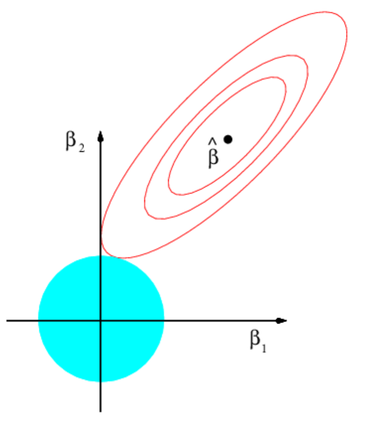
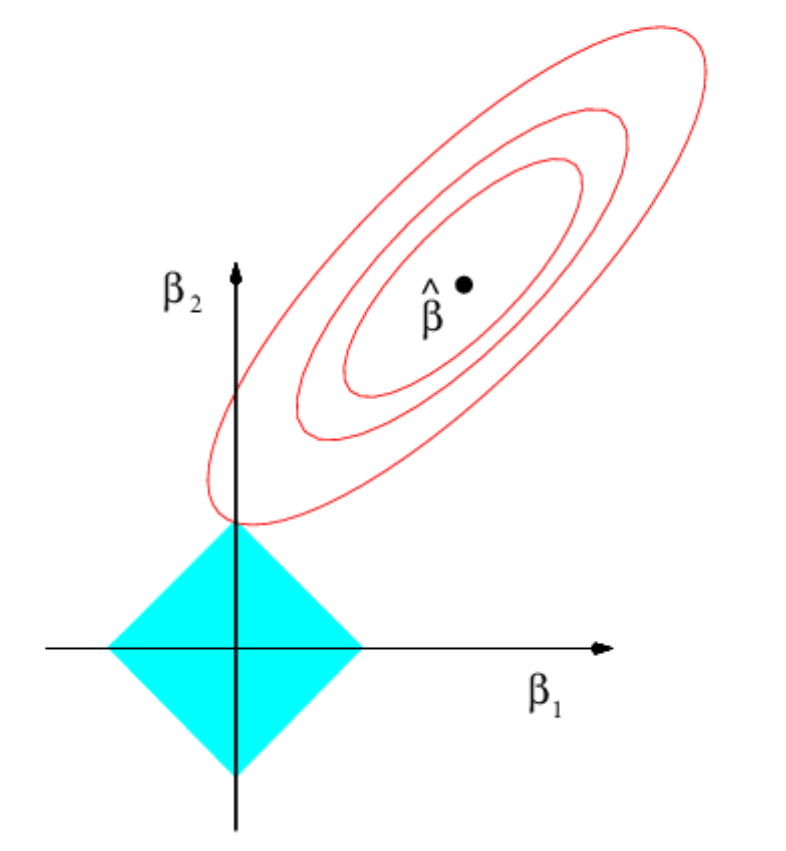

class: title-slide

# Review
$$
  \require{cancel}
  \DeclareMathOperator*{\argmin}{arg\,min}
$$
  
```{r, echo = F, message=F, warnings=F}
library(tidyverse)
library(haven)
library(estimatr)
library(knitr)
library(splines)
library(lubridate)

options(digits=3)

set.seed(60639)

```

---

# Previously

$$
  \DeclareMathOperator*{\argmax}{arg\,max}
$$

- **Item response theory**
  - **Factor model** for categorical/nominal outcome variables
  - Model a matrix of **individual** responses across multiple common **questions**
  - Responses are a function of a common **indivdual** latent parameter
  - Identification via Bayes (prior on the individual latent parameters defines the scale/location).
---

# This week

- **Flexible functional forms**
  - Semi-/Non-parametric approaches to modeling CEFs of $Y_i$ given a continuous $X_i$
  - Regression and smoothing splines to allow for flexible relationships between 
  - Penalty term to avoid "jumpy" regressions
  - Generalized Additive Models (GAMs) that combine "parametric" and "semi-/non-parametric" components
- **Regularization**
  - Why regularize?
  - $L_0$, $L_1$, and $L_2$ norms
  - Value of the lasso (the $L_1$ norm) - "sparse" regressions
  - Interpreting regularization in Bayesian terms.
  
---
class: title-slide

# Flexible regression

---

# Flexible regression

- A common task in statistics is estimating the conditional expectation function $E[Y|X]$.
  - But typical methods for estimating the CEF assume that we know its functional form.
  - For example, we assume linearity -- can be trivially satisfied when $X$ is discrete, but potentially problematic when $X$ is continuous.
--

$$E[Y|X] = f(X) =  X\beta$$
--

- We want to maintain the utility of a model that is **linear in the parameters** but introduce transformations of $X$ to capture potentially non-linear relationships between $Y$ and $X$.
--

- Define the **linear basis expansion** for a set of $M$ basis functions $h_m(X)$

$$f(X) = \sum_{m=1}^M \beta_m h_m(X)$$
  
---

# Example: Modeling Bike Rentals

- **Bikeshare usage** is highly variable from day-to-day and hour-to-hour. Capital Bikeshare in Washington D.C. recorded the hourly count of active users over a two-year period from 2011 to 2012.
  - For more on the dataset, see: Fanaee-T, Hadi, and Gama, Joao, "Event labeling combining ensemble detectors and background knowledge", *Progress in Artificial Intelligence* (2013): pp. 1-15
--

```{r, warning=F, message=F}
bike <- read_csv("data/bikes_hour.csv")
bike_by_hour <- bike %>% group_by(hr) %>% summarize(cnt = mean(cnt))
```

---

# Example: Modeling Bike Rentals

- From the scatterplot of active usage vs. hour of the day, a simple linear fit (slope + intercept) seems quite poor at capturing the CEF
--

```{r, message = F, warning=F, fig.width=9, fig.height=6, fig.align="center", echo=F}
bike %>% ggplot(aes(x=hr, y=cnt)) + geom_point(alpha=.1) + geom_point(data=bike_by_hour, col="red", shape=15, size=5) + geom_smooth(method="lm", linewidth=2) + xlab("Hour of the day") + ylab("Count of Users") +
  theme_bw() + theme(text = element_text(size = 16))     
```

---

# Polynomial basis

- A common set of basis functions to choose are the **global polynomial** basis
  - You've probably already done this when you've included squared terms in your regressions!
--

- For example, for a univariate $X$, the basis for a global cubic polynomial is:

$$\begin{align*}h_1(X) &= 1\\
h_2(X) &= X\\
h_3(X) &= X^2\\
h_4(X) &= X^3\end{align*}$$

--

- A $K$th order polynomial requires $K+1$ parameters
--

- However, there are some drawbacks to using a global polynomial - namely that each observation influences the **entire** curve.

---

# Polynomial basis

```{r, message = F, warning=F, fig.width=9, fig.height=6, fig.align="center", echo=F}
bike %>% ggplot(aes(x=hr, y=cnt)) + geom_point(alpha=.1) + geom_point(data=bike_by_hour, col="red", shape=15, size=5)  +   geom_smooth(method="lm", formula = y ~ x + I(x^2) + I(x^3), linewidth=2) + 
  xlab("Hour of the day") + ylab("Count of Users") +
  theme_bw() + theme(text = element_text(size = 16)) + ggtitle("Cubic polynomial")
```

---

# Polynomial basis

```{r, message = F, warning=F, fig.width=9, fig.height=6, fig.align="center", echo=F}
bike %>% ggplot(aes(x=hr, y=cnt)) + geom_point(alpha=.1) + geom_point(data=bike_by_hour, col="red", shape=15, size=5)  +   geom_smooth(method="lm", formula = y ~ x + I(x^2) + I(x^3) + I(x^4) + I(x^5) + I(x^6) + I(x^7) + I(x^8) + I(x^9) + I(x^10) + I(x^11) + I(x^12) + I(x^13) + I(x^14) + I(x^15) + I(x^16) + I(x^17) + I(x^18) + I(x^19) + I(x^20), linewidth=2) + 
  xlab("Hour of the day") + ylab("Count of Users") +
  theme_bw() + theme(text = element_text(size = 16)) + ggtitle("20th order polynomial")
```

---

# Step functions

- Instead of forcing a single **global** polynomial, we might instead want to fit a set of **local** averages to different regions of $X$
--

- We could define a set of basis functions that are indicators which partition $X$ into $M+1$ disjoint regions based on cutpoints $\xi_1, \xi_2, \dotsc, \xi_{M}$

$$\begin{align*}
h_1(X) &= I(X < \xi_1)\\
h_2(X) &= I(\xi_1 \le X < \xi_2)\\
h_3(X) &= I(\xi_2 \le X < \xi_3)\\
&\vdots\\
h_{M+1}(X) &= I(\xi_{M} \le X)\\
\end{align*}$$


---

# Step functions

```{r, message = F, warning=F, fig.width=9, fig.height=6, fig.align="center", echo=F}
bike %>% ggplot(aes(x=hr, y=cnt)) + geom_point(alpha=.1) + geom_point(data=bike_by_hour, col="red", shape=15, size=5)  +   geom_smooth(method="lm", formula = y ~ I(x < 6) + I(x >= 6&x<12) + I(x >= 12&x<18) + I(x>= 18), linewidth=2) + 
  xlab("Hour of the day") + ylab("Count of Users") + ggtitle("Even intervals")  + geom_vline(xintercept = c(6, 12, 18), lty=2, linewidth=2, col="green3") + 
  theme_bw() + theme(text = element_text(size = 16)) 
```

---

# Step functions

```{r, message = F, warning=F, fig.width=9, fig.height=6, fig.align="center", echo=F}
bike %>% ggplot(aes(x=hr, y=cnt)) + geom_point(alpha=.1) + geom_point(data=bike_by_hour, col="red", shape=15, size=5)  +   geom_smooth(method="lm",  formula = y ~ I(x < 7) + I(x >= 7&x<9) + I(x >= 9&x<16) + I(x>= 16&x<18) + I(x>= 18), linewidth=2) + 
  xlab("Hour of the day") + ylab("Count of Users") + ggtitle("Uneven intervals") + geom_vline(xintercept = c(7, 9, 16, 18), lty=2, linewidth=2, col="green3") + 
  theme_bw() + theme(text = element_text(size = 16)) 
```

---

# Piecewise polynomials

- Rather than just taking the mean within each disjoint region, we could imagine fitting a polynomial to **just** that subset.

```{r, message = F, warning=F, fig.width=9, fig.height=6, fig.align="center", echo=F}
bike %>% ggplot(aes(x=hr, y=cnt)) + geom_point(alpha=.1) + geom_point(data=bike_by_hour, col="red", shape=15, size=5)  +   geom_smooth(method="lm",  formula = y ~ (I(x < 6) + I(x >= 6&x<12) + I(x >= 12&x<18) + I(x>= 18))*(x + I(x^2) + I(x^3)), linewidth=2) + 
  xlab("Hour of the day") + ylab("Count of Users") + ggtitle("Piecewise cubic polynomial") + geom_vline(xintercept = c(6, 12, 18), lty=2, linewidth=2, col="green3") + 
  theme_bw() + theme(text = element_text(size = 16)) 
```

---

# Splines

- The piecewise polynomials might fit better, but we still have these irritating discontinuities in the CEF.
  - We might want to impose some **additional** conditions on the function regarding continuity around the cutpoints.
--

- A $K-1$th order **spline** with $M$ knots $\xi_1, \xi_2, \dotsc, \xi_{M}$ is a piece-wise polynomial that...
  - ...is a polynomial of degree $K-1$ on the intervals $(-\infty, \xi_1,], [\xi_1, \xi_2], [\xi_2, \xi_3], \dotsc, [\xi_m, \infty)$
  - ...has a $j$th derivative that is continuous at each of the knots $\xi_1, \xi_2, \dotsc, \xi_{m}$ for $j = 0, 1, 2, \dotsc, K-2$ 
--

- Intuitively, if we **also** forced the $k$th derivative to be continuous, we'd recover the **global** polynomial.
--

- Most common spline is the **cubic** spline $k = 4$ (third order polynomial).
  - Splines allow for local flexibility while still retaining continuity across $X$.
  
---

# Splines

- There are actually multiple ways to define the basis functions for a spline. The most intuitive for understanding how they work is the **truncated power basis**

$$\begin{align*}
h_{k}(X) &= x^{k-1} & \ \ & k = 1, \dotsc, K\\
h_{m+K}(X) &= (x - \xi_{m})_+^{K-1} & \ \ & m = 1, \dotsc, M
\end{align*}$$

where $(\cdot)_+$ denotes a function which returns $\text{max}(\cdot, 0)$
--

- Splines have $M + K$ "degrees of freedom"
  - "Natural" splines add the constraint that the function is **linear** beyond the constraints of the data
--

- When the degree and number of knots are fixed, commonly called **regression splines**
  - Contrast with **smoothing splines** where number of indirectly controlled via penalization
--

- **Trade-offs**
  - Higher $K$ and higher $M$ = better in-sample fit but risks overfitting
  - Lower $K$ and lower $M$ = poorer in-sample fit (baseline is a global polynomial), but potentially more robust out-of-sample.
  

---

# Splines

```{r, message = F, warning=F, fig.width=9, fig.height=6, fig.align="center"}
bike %>% ggplot(aes(x=hr, y=cnt)) + geom_point(alpha=.1) + geom_point(data=bike_by_hour, col="red", shape=15, size=5)  +   geom_smooth(method="lm",  formula = y ~ x + I(x^2) + I(x^3) + I((x-6)>0):I((x - 6)^3) +  I((x-12)>0):I((x - 12)^3) + I((x-18)>0):I((x - 18)^3) , linewidth=2) + 
  xlab("Hour of the day") + ylab("Count of Users") + ggtitle("Cubic spline with 6 degrees of freedom (+ intercept)") + geom_vline(xintercept = c(6, 12, 18), lty=2, linewidth=2, col="green3") + 
  theme_bw() + theme(text = element_text(size = 16)) 
```

---

# B-splines

- Recall that there are multiple ways of defining the basis functions that construct a spline.
  - Truncated power basis is interpretable but can have poor computational properties
--

- Alternative: **B-spline** basis
  - Define the spline basis **recursively**
  - Advantage: Non-zero over a limited domain
--

- For a sequence of $K+M$ knots $\tau_1, \tau_2, \dotsc, \tau_{M+K}$

$$\begin{align*}
B_{i, 1}(x) &= \begin{cases} 1 & \text{if} &\tau_i \le x < \tau_{i+1}\\
0 & \text{otherwise} \end{cases}\\
B_{i, m}(x) &= \frac{x - \tau_i}{\tau_{i + m -1} -\tau_i} B_{i,m-1}(x) + \frac{\tau_{i+m} - x}{\tau_{i + m} - \tau_{i+1}} B_{i+1, m-1}(x)
\end{align*}$$

--

- **Intuition**: Basis functions for higher-order splines are weighted averages of the "neighboring" lower-order basis functions 
  
---

# B-splines

- R will generate a b-spline basis for you using the `bs()` function in `splines`
  - You can treat these like transformations of the regressors 

```{r}
bike_bs <- bs(bike$hr, df=6) # By default it's a cubic (degree = 3) and the intercept is omitted
head(bike_bs)
attributes(bike_bs)$knots
```

---

# Splines

```{r, message = F, warning=F, fig.width=9, fig.height=6, fig.align="center"}
bike %>% ggplot(aes(x=hr, y=cnt)) + geom_point(alpha=.1) + geom_point(data=bike_by_hour, col="red", shape=15, size=5)  +   geom_smooth(method="lm",  formula = y ~ bs(x, df=6), linewidth=2) + 
  xlab("Hour of the day") + ylab("Count of Users") + ggtitle("Cubic spline with 6 degrees of freedom (+ intercept)") + geom_vline(xintercept = c(6, 12, 18), lty=2, linewidth=2, col="green3") + 
  theme_bw() + theme(text = element_text(size = 16)) 
```

---


# Splines

```{r, message = F, warning=F, fig.width=9, fig.height=6, fig.align="center"}
bike %>% ggplot(aes(x=hr, y=cnt)) + geom_point(alpha=.1) + geom_point(data=bike_by_hour, col="red", shape=15, size=5)  +   geom_smooth(method="lm",  formula = y ~ bs(x, df=6)[,1], linewidth=2) + 
  xlab("Hour of the day") + ylab("Count of Users") + ggtitle("First cubic b-spline basis") + geom_vline(xintercept = c(6, 12, 18), lty=2, linewidth=2, col="green3") + 
  theme_bw() + theme(text = element_text(size = 16)) 
```

---

# Splines

```{r, message = F, warning=F, fig.width=9, fig.height=6, fig.align="center"}
bike %>% ggplot(aes(x=hr, y=cnt)) + geom_point(alpha=.1) + geom_point(data=bike_by_hour, col="red", shape=15, size=5)  +   geom_smooth(method="lm",  formula = y ~ bs(x, df=6)[,4], linewidth=2) + 
  xlab("Hour of the day") + ylab("Count of Users") + ggtitle("Fourth cubic b-spline basis") + geom_vline(xintercept = c(6, 12, 18), lty=2, linewidth=2, col="green3") + 
  theme_bw() + theme(text = element_text(size = 16)) 
```

---

# Splines

- Splines with many degrees of freedom have potentially weird behavior in areas with little data - "squiggly" interpolations

```{r, message = F, warning=F, fig.width=9, fig.height=6, fig.align="center", echo=F}
bike %>% ggplot(aes(x=hr, y=cnt)) + geom_point(alpha=.1) + geom_point(data=bike_by_hour, col="red", shape=15, size=5)  +   geom_smooth(method="lm",  formula = y ~ bs(x, df=15), linewidth=2) + 
  xlab("Hour of the day") + ylab("Count of Users") + ggtitle("Cubic spline with 15 degrees of freedom (+ intercept)") + 
  theme_bw() + theme(text = element_text(size = 16)) 
```

---

# Smoothing splines

- What if we set the **maximum** possible number of knots 
  - $N$ total knots -- one for each observation
--

- Without penalization, we would have $N+4$ parameters for a cubic spline for $N$ observations.
  - This is not feasible using conventional least-squares - the solution is underdetermined!
--

- What if we controlled the fit via some **penalty** parameter
  - All-else-equal, we'd prefer a fit where the regression function is not very "jumpy"
  - Formalize this in terms of the second-derivative $f^{\prime\prime}(x)$
--

- Our "smoothing spline" takes the form of a **penalized** optimization problem. We want to find the function $f(x)$ that minimizes:

$$\sum_{i=1}^n (Y_i - f(X_i))^2 + \lambda \int f^{\prime\prime}(t)dt$$

where $\lambda$ is a non-negative "tuning" or "penalty" parameter.

---

# Smoothing splines

- It turns out that the function $f()$ that optimizes the "smoothing spline" objective function has some useful features
  1. It's a piecewise cubic polynomial
  2. It has knots at the unique values of the data $x_1, x_2, \dotsc, x_N$
  3. It has continuous first and second derivatives at each of the knots.
  4. It's linear outside of the knots
--

- It's a **natural cubic spline**
  - But with **penalized** parameter estimates (shrunken towards zero)
--

- $\lambda$ chosen via cross-validation
  - Can conduct leave-one-out cross-validation very easily (formula exists to use the fit for all observations, so no need to re-fit)

---

# Generalized Additive Models

- **Generalized Additive Models** (GAMs) allow us to extend the conventional multiple linear regression model to accomodate the non-linear transformations of $X_i$.
- Instead of our original linear model:

$$Y_i = \beta_0 + \beta_1 X_{i1} + \beta_2 X_{i2} + \dotsc + \epsilon_{i}$$

- We fit:

$$Y_i = \beta_0 + f_1(X_{i1}) + f_2(X_{i2}) + \dotsc + \epsilon_{i}$$

--

- With conventional regression splines for $f_1(), f_2(), f_3()$, etc..., this just becomes a giant linear regression with the spline bases substituted for the original regressors
- With *smoothing splines*, slightly more complicated - can't use OLS, but conventional software (`gam()` in R) implements the "backfitting" algorithm.
- Can extend to other functions $f_i()$ such as local regressions or just plain polynomials

---

# Generalized Additive Models

- Fitting our smoothing spline using the `gam()` function in the `mgcv` library

```{r, warning=F, message=F, echo=F}
library(mgcv)
```

```{r}
hour_fit <- gam(cnt ~ s(hr, bs="cr"), data = bike)
summary(hour_fit)
```

---

# Generalized Additive Models

- We can combine "parametric" and "non-parametric" terms in the `gam()` function

```{r}
hour_work_fit <- gam(cnt ~ workingday + s(hr, bs="cr"), data=bike)
summary(hour_work_fit)
```

---

# Generalized Additive Models

- Smoothing splines are also the default in `geom_smooth()` for large datasets

```{r, message = F, warning=F, fig.width=9, fig.height=6, fig.align="center", echo=F}
bike %>% ggplot(aes(x=hr, y=cnt)) + geom_point(alpha=.1) + geom_point(data=bike_by_hour, col="red", shape=15, size=5)  +   geom_smooth(method="gam", formula = y ~ s(x, bs="cr"), linewidth=2) + 
  xlab("Hour of the day") + ylab("Count of Users") + ggtitle("Smoothing spline") + 
  theme_bw() + theme(text = element_text(size = 16)) 
```

---

class: title-slide

# Regularization

---

# Regularization

```{r, message = F, warning=F, fig.width=9, fig.height=6, fig.align="center", echo=F}
bike %>% ggplot(aes(x=hr, y=cnt)) + geom_point(alpha=.1) + geom_point(data=bike_by_hour, col="red", shape=15, size=5) + geom_smooth(method="lm", linewidth=2) + xlab("Hour of the day") + ylab("Count of Users") +
  theme_bw() + theme(text = element_text(size = 16))     
``` 

---

# Regularization

```{r, message = F, warning=F, fig.width=9, fig.height=6, fig.align="center", echo=F}
bike %>% ggplot(aes(x=hr, y=cnt)) + geom_point(alpha=.1) + geom_point(data=bike_by_hour, col="red", shape=15, size=5)  +   geom_smooth(method="lm",  formula = y ~ bs(x, df=15), linewidth=2) + 
  xlab("Hour of the day") + ylab("Count of Users") +
  theme_bw() + theme(text = element_text(size = 16)) 
```

---

# Regularization

```{r, message = F, warning=F, fig.width=9, fig.height=6, fig.align="center", echo=F}
bike %>% ggplot(aes(x=hr, y=cnt)) + geom_point(alpha=.1) + geom_point(data=bike_by_hour, col="red", shape=15, size=5)  +   geom_smooth(method="gam", formula = y ~ s(x, bs="cr"), linewidth=2) + 
  xlab("Hour of the day") + ylab("Count of Users")  + 
  theme_bw() + theme(text = element_text(size = 16)) 
```

---

# Regularization

- The **error** of an estimator is a function of both its **bias** and its **variance**
  - We often talk about **unbiased** estimation as a goal of statistics?
  - Why? - Because we can accurately characterize the remaining error - the variance.
--

- But in other settings, we just want to know whether our point estimate is close to the truth
  - In this setting we might be willing to accept some **bias** in exchange for a reduction in variance.
--

- We've already done this to some extent:
  - Setting an **informative prior** in the Bayesian regression setting pulls the estimates to our existing beliefs
  - Sharper prior $\leadsto$ lower variance posterior distributions
--

- What sort of bias do we want to induce?
  - In a **regression**: bias the coefficients towards *zero*
  - Intuition: *betting on sparsity* - most regressors are irrelevant and their coefficients should be pulled towards zero.

---

# Mean Squared Error

- Recall that the **mean squared error** of an estimator $\hat{\theta}$ of some parameter $\theta$ can be decomposed into the (squared) **bias** and the **variance**

$$E\bigg[(\hat{\theta} - \theta)^2\bigg] = E\bigg[\theta^2\bigg] - 2\theta E\bigg[\hat{\theta}\bigg] + \theta^2$$
--

- Add and subtract $E[\hat{\theta}]^2$

$$E\bigg[(\hat{\theta} - \theta)^2\bigg] = \bigg(E[\theta^2]-  E[\hat{\theta}]^2\bigg)  + E[\hat{\theta}]^2 - 2\theta E[\hat{\theta}] + \theta^2$$
--

- And factoring to get the bias squared

$$\underbrace{E\bigg[(\hat{\theta} - \theta)^2\bigg]}_{\text{MSE}} = \underbrace{\bigg(E[\theta^2]-  E[\hat{\theta}]^2\bigg)}_{\text{Variance}}  + \underbrace{\bigg(E[\hat{\theta} - \theta]\bigg)^2}_{\text{Squared Bias}}$$

---

# Notation notes

- We're going to work with a standard regression setting with outcome $Y_i$ and covariate matrix $\mathbf{X}$.
  - We'll assume the covariates are **standardized** to have mean zero and variance 1 (we don't want our regularizer to depend on the scale of the inputs).
--

- Let $||\cdot||_p$ denote the $L_p$ norm.
  - The $L_2$ norm is the **euclidean norm**: $|| \beta ||_2 = \sqrt{\sum_{k=1}^K |\beta|^2}$
  - The $L_1$ norm is the sum of the absolute values  $|| \beta ||_1 = \sum_{k=1}^K |\beta|$
  - More generally, the $L_p$ norm is: $|| \beta ||_p = \bigg(\sum_{k=1}^K |\beta|^p\bigg)^{\frac{1}{p}}$
  
---

# Example: Predicting Peace Agreements

- Many predictive involve **large numbers of covariates** relative to the total number of observations
  - If all of the covariates are in some sense "relevant" then you're probably out of luck.
  - But in most settings, only a handful of the covariates actually matter...the problem is that you don't know which ones ex-ante.
--

- The **UCDP Peace Agremeents dataset** contains information on peace agreements to armed conflicts from the period 1975-2021
  - We may want to know what factors predict durable peace agreements.
  
```{r, warning=F,message=F}
pa <- read_csv("data/ucdp-peace-agreements-221.csv")
```

--

- Some brief pre-processing of the outcome

```{r}
# If agreement remains, then duration = "now"
pa$duration_complete <- pa$duration
pa$duration[is.na(pa$duration)] <- ymd("2021-12-31")
pa$durationDays <- as.numeric(pa$duration - pa$pa_date)
# Fill in missing "ended' data
pa$ended_full <- as.numeric(pa$ended)
pa$ended_full[is.na(pa$ended_full)] <- 0
```

---

# Example: Predicting Peace Agreements

```{r, echo=F, warning=F, message=F, fig.align="center", fig.width=9, fig.height=6}
pa %>% ggplot(aes(x=durationDays)) + geom_histogram() + theme_bw() + xlab("Peace Agreement Duration (Days)")
```

---

# Example: Predicting Peace Agreements

- Our covariates are a large number of coded features for each agreement

```{r}
pa_x <- model.matrix(durationDays ~ as.factor(region) + year + as.factor(incompatibility) +
                       cease + intarmy + ddr + withd + mil_prov + pp + intgov + intciv +
                       elections + interim + natalks + shagov + pol_prov + aut + fed + ind +
                       ref + shaloc + regdev + cul + demarcation + locgov + terr_prov + amn +
                       pris + recon + return + justice_prov + reaffirm + outlin + pko + gender +
                       co_impl + termdur + txt + as.factor(inclusive) + as.factor(pa_type) +
                       as.factor(out_iss) + as.factor(frame), data=pa)[,-1]
```

- We have 55 covariates across 374 observations.
  - We *can* get an OLS estimate, but our sense is that these will be incredibly noisy.

---

# Ridge regression

- Our typical (gaussian) linear regression estimator finds the $\beta$ that **minimizes** the residual sum of squares (RSS)

$$\text{RSS} = \sum_{i=1}^N (Y_i - X_i^{\prime}\beta)^2$$
- For non-gaussian models, replace the residual sum of squares with the log-likelihood (the RSS *is* the negative log-likelihood for a gaussian)

--

- **Ridge regression** augments the objective function by adding a penalty term

$$\sum_{i=1}^N (Y_i - X_i^{\prime}\beta)^2 + \lambda\sum_{k=1}^K \beta_k^2$$
where $\lambda$ is a user-specified penalty parameter
--

- Note that we'll typically avoid regularizing the **intercept** $\beta_0$.

---

# Bayesian interpretation

- Ridge regression has an interpretation in terms of a **bayesian regression**
- Consider our normal model with:

$$Y_i |X_i, \beta \sim \text{Normal}(X_i^{\prime}\beta, \sigma^2)$$
--

- The log-posterior can be written as

$$\log p(\beta | \mathbf{X}, Y) \propto \log p(Y | \mathbf{X}, \beta) + \log p(\beta)$$
--

- In a gaussian model, the first part is just the (negative) residual sum of squares

$$\log p(\beta | \mathbf{X}, Y) \propto - \frac{1}{2\sigma^2}\sum_{i=1}^N  (Y_i - X_i^{\prime}\beta)^2  + \log p(\beta)$$
---

# Bayesian interpretation

- Now, suppose we put a conventional normal prior on $\beta$

$$\beta \sim \text{Normal}(0, \tau^2I)$$
--

- $\log p(\beta)$ can then be written as:

$$\begin{align*}\log p(\beta) &= -\frac{1}{2\tau^2} \sum_{k=1}^K (\beta_k - 0)^2\\
&= -\frac{1}{2\tau^2} \sum_{k=1}^K \beta_k^2\end{align*}$$
--

- Plugging back in to the log-posterior, we have

$$\log p(\beta | \mathbf{X}, Y) \propto - \frac{1}{2\sigma^2}\sum_{i=1}^N  (Y_i - X_i^{\prime}\beta)^2  - \frac{1}{2\tau^2} \sum_{k=1}^K \beta_k^2$$
---

# Bayesian interpretation

- Rearranging terms and dropping scaling constants, we have

$$\log p(\beta | \mathbf{X}, Y) \propto - \sum_{i=1}^N  (Y_i - X_i^{\prime}\beta)^2  - \frac{\sigma^2}{\tau^2} \sum_{k=1}^K \beta_k^2$$
--

- With $\lambda = \frac{\sigma^2}{\tau^2}$, this is just the negative of the ridge regression objective function
  - Maximizing the log-posterior (finding the MAP estimate) is equivalent to minimizing a ridge regression objective! 

---

# Visualizing the penalty

- Penalized regression can also be interpreted as a **constrained optimization problem**
- Find the $\beta$ that minimizes:

$$\text{RSS} = \sum_{i=1}^N (Y_i - X_i^{\prime}\beta)^2$$
- Subject to

$$\sum_{k=1}^K \beta_k^2 \le s$$
--

- We prefer the unconstrained formulation with $\lambda$ for computation, but the constrained view allows us to get a sense of how the ridge regularizer is operating.

---

# Visualizing the penalty

.center[]

---

# Example: Predicting Peace Agreements

- The standard library for estimating penalized regressions in R is `glmnet`
  - By default, R will fit the model for a **regularization sequence** of $\lambda$
  - Actually choosing a $\lambda$ is done via cross-validation

```{r, echo=F, warning=F, message=F}
library(glmnet)
```
--

- Let's fit a gaussian model (we could do poisson as well, but gaussian is easy)

```{r}
# alpha=0 is the ridge penalty
conflict_ridge <- glmnet(x=pa_x, y=log(pa$durationDays), family="gaussian", alpha=0, standardize=T)
```

---

# Example: Predicting Peace Agreements

- How is the in-sample fit?

```{r, fig.align = "center", fig.width=8, fig.height=6}
plot(x=log(conflict_ridge$lambda), y=1-conflict_ridge$dev.ratio, type='l', xlab="(logged) Lambda", ylab="1 - Fraction of the deviance explained")
```

---

# Selecting the penalty

- $\lambda$ is typically selected via cross-validation

```{r}
conflict_ridge_cv <- cv.glmnet(x=pa_x, y=log(pa$durationDays), family="gaussian", alpha=0, standardize=T)
print(conflict_ridge_cv)
```
--

- `cv.glmnet` typically provides two choices of $\lambda$
  - The first being the value that minimizes the cross-validation error (`min`)
  - The second being the largest value of $\lambda$ that is still within 1 standard error from the minimum (`1se`)

---

# Selecting the penalty

- Low penalties can lead to **bad** out-of-sample fit!

```{r, fig.align = "center", fig.width=8, fig.height=6}
plot(x=log(conflict_ridge_cv$lambda), y=conflict_ridge_cv$cvm, type='l', xlab="(logged) Lambda", ylab="Cross-validation error")
```

---

# Lasso

- **Ridge regression** regularizes the coefficients towards zero, but it does not guarantee that some coefficients are exactly zeroed out.
  - In other words, it does not do **model selection**
--

- We would like to have a penalty term that results in **sparse** solutions - ones where many coefficients are explicitly set to $0$
  - The $L_1$ penalty accomplishes this!
  - The **least absolute shrinkage and selection operator** or lasso is the same penalized regression as the ridge regression but with the sum of the **absolute** rather than squared coefficients in the penalty
--

$$\sum_{i=1}^N (Y_i - X_i^{\prime}\beta)^2 + \lambda\sum_{k=1}^K |\beta_k|$$
--

- The $L_1$ norm is non-differentiable with respect to the covariates at $0$, which leads to the lasso acting as a "selection" operator on the elements of $\beta$

---

# Visualizing the lasso

- As with ridge, the lasso has an expression in terms of a constrained optimization problem:
- Find the $\beta$ that minimizes:

$$\text{RSS} = \sum_{i=1}^N (Y_i - X_i^{\prime}\beta)^2$$
- Subject to

$$\sum_{k=1}^K |\beta_k| \le s$$

---

# Visualizing the lasso

.center[]

---

# Bayesian lasso

- The lasso also has an interpretation as a Bayesian prior placed on $\beta$.
  - But instead of the normal, the prior is the **Laplace** or double-exponential distribution
  - Location parameter $\mu = 0$, scale parameter $b$
--

$$p(\beta_k) = \frac{1}{2b} \exp\bigg\{ -\frac{|\beta_k|}{b}\bigg\}$$

---

# Example: Predicting Peace Agreements

```{r}
# alpha=1 is the lasso penalty
conflict_lasso <- glmnet(x=pa_x, y=log(pa$durationDays), family="gaussian", alpha=1)
```

---

# Example: Predicting Peace Agreements

- We can count the number of coefficients set to $0$ as $\lambda$ increases

```{r, fig.align = "center", fig.width=8, fig.height=6}
plot(x=log(conflict_lasso$lambda), y=colSums(coef(conflict_lasso) == 0), type='l', xlab="(logged) Lambda", ylab="Number of zero coefficients")
```

---

# Example: Predicting Peace Agreements

- In-sample fit improves as we reduce $\lambda$

```{r, fig.align = "center", fig.width=8, fig.height=6}
plot(x=log(conflict_lasso$lambda), y=1- conflict_lasso$dev.ratio, type='l', xlab="(logged) Lambda", ylab="1 - Fraction of the deviance explained")
```

---

# Example: Predicting Peace Agreements

- We again choose $\lambda$ via cross-validation

```{r}
conflict_lasso_cv <- cv.glmnet(x=pa_x, y=log(pa$durationDays), family="gaussian", alpha=1)
print(conflict_lasso_cv)
```


---

# Example: Predicting Peace Agreements

- Cross-validation error does not strictly improve with lower $\lambda$

```{r, fig.align = "center", fig.width=8, fig.height=6}
plot(x=log(conflict_lasso_cv$lambda), y=conflict_lasso_cv$cvm, type='l', xlab="(logged) Lambda", ylab="Cross-validation error")
```

---

# Lasso as variable selection

- **Variable selection** is a common problem in statistics
  - We assume a world where among our covariates $X$, some small subset have actual non-zero coefficients (they "matter") but most don't.
  - The problem is that ex-ante, we have no idea what the relevant covariates actually are!
--

- Classical approaches
  - **Forward selection** - Start with an empty model and add variables one-by-one.
  - **Backward selection** - Start with a full model and remove the least correlated variables one-by-one.
--

- The lasso can be thought of as an alternative to these techniques
  - Advantages in computational time/feasibility as well as potential **predictive** benefits from shrinkage.

---

# Example: Predicting Peace Agreements

- Let's fit the lasso with the "best" cross-validated $\lambda$

```{r}
conflict_lasso_best <- glmnet(x=pa_x, y=log(pa$durationDays), family="gaussian", alpha=1, lambda=conflict_lasso_cv$lambda.min)
```

- Which coefficients are non-zero?

```{r}
coef(conflict_lasso_best)[,1][coef(conflict_lasso_best)[,1] != 0]
```

---

# Example: Predicting Peace Agreements

- What if we took the "selected" variables and just ran OLS?

```{r}
pa_x_use <- cbind(1, pa_x[,names(coef(conflict_lasso_best)[,1][coef(conflict_lasso_best)[,1] != 0])[-1]])
beta_ols <- as.vector(solve(t(pa_x_use)%*%pa_x_use)%*%t(pa_x_use)%*%log(pa$durationDays))
names(beta_ols) <- names(coef(conflict_lasso_best)[,1][coef(conflict_lasso_best)[,1] != 0])
beta_ols
```
--

- The OLS coefficients post-selection are larger in magnitude!
  - Why? Lasso induces a **bias** towards zero
  
---

# Causal inference and "double lasso"

- Lasso coefficients are **biased** towards zero
  - This bias is often desirable for prediction (see Stein's paradox)
  - But this bias is undesirable for inference (conventional CIs don't have the right coverage).
--

- Often we have a causal inference problem where the goal is to estimate the effect of some treatment $D_i$ on outcome $Y_i$ under an assumption of  **selection-on-observables** given $X_i$
  - But we don't know which covariates matter (or possibly their functional forms).
  - We want to control for variables that predict $Y_i$ and predict $D_i$ - degree of omitted variable bias is a **product** of these two relationships

---

# Causal inference and "double lasso"

- **Belloni, Chernozhukov and Hansen (2014)** suggest an approach that uses the lasso for variable selection but OLS to obtain an unbiased estimator of the treatment effect - the "double lasso"

- **Step 1:** Fit a **lasso** regression of outcome on covariates

$$Y_i = \alpha_0 + \alpha_1 X_{i1} + \alpha_2 X_{i2} + \dotsc \alpha_K X_{iK} + \epsilon_i$$

- **Step 2:** Fit a **lasso** regression of treatment on covariates

$$D_i = \delta_0 + \delta_1 X_{i1} + \delta_2 X_{i2} + \dotsc \delta_K X_{iK} + \epsilon_i$$
- **Step 3:** Let $A$ denote the set of covariates selected in **either** the first or the second regression.

- **Step 4:** Fit an **OLS** regression of outcome on treatment and the covariates in $A$

$$Y_i = \tau D_i + \sum_{k \in A} \beta_k X_{ik} + \epsilon_i$$
